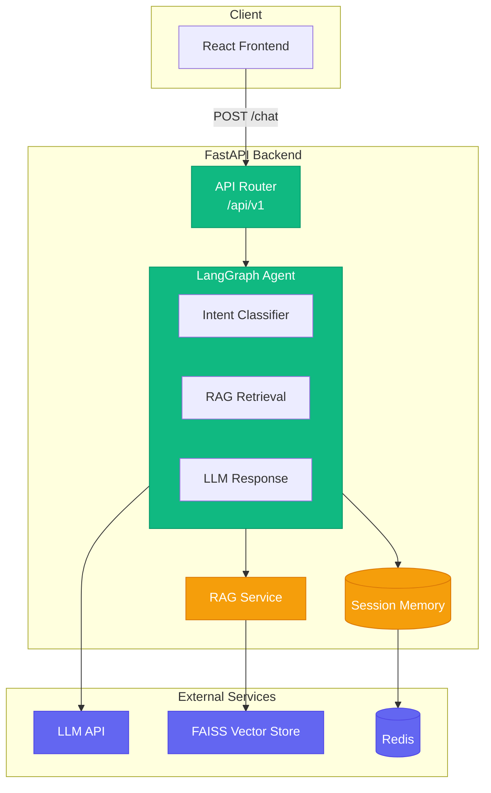

# Life Insurance AI Support Agent

FastAPI-based AI agent system for life insurance customer support with RAG (Retrieval-Augmented Generation).

## Documentation

For comprehensive documentation, see the `docs/` folder:

- **[Quick Start](docs/QUICKSTART.md)** - Get running in 5 minutes
- **[API Reference](docs/API.md)** - Detailed API endpoints
- **[Technical Documentation](docs/TECHNICAL.md)** - Architecture, diagrams, and deep-dives

## Architecture



## Demo

<video src="https://github.com/mazleon/chatbot-rag-ray/blob/main/docs/Demo_Of_Conversation.mp4?raw=1" controls width="800">Demo Video</video>

## Features

- **🤖 AI Agent**: LangGraph-based multi-step agent with intent classification
- **📚 RAG System**: FAISS vector store for document retrieval
- **💬 Conversational Memory**: Remembers conversation context and user info
- **📄 Document Upload**: Upload PDF, DOCX, TXT files to knowledge base
- **🔍 Smart Search**: Retrieves relevant documents based on queries
- **📊 Observability**: LangFuse integration for LLM tracing
- **🐳 Docker**: Full-stack Docker deployment
- **⚡ FastAPI**: High-performance async API

## Quick Start

### Docker Compose (Recommended)

```bash
# 1. Copy environment template
cp .env.docker .env

# 2. Edit .env with your API key
#    - Get OpenAI key: https://platform.openai.com/api-keys

# 3. Start all services
docker-compose up --build
```

**Services:**
- Backend: http://localhost:8000
- Frontend: http://localhost:5173
- API Docs: http://localhost:8000/docs
- Redis: http://localhost:6379

### Option 2: Local Development

```bash
# Backend
cp .env.example .env
# Edit .env with your API keys
uv sync
uv run uvicorn main:app --reload

# Frontend (separate terminal)
cd frontend
npm install
npm run dev
```

## Environment Variables

### Required
| Variable | Description | Get from |
|----------|-------------|----------|
| `OPENAI_API_KEY` | OpenAI API key | https://platform.openai.com/api-keys |

### Optional
| Variable | Default | Description |
|----------|---------|-------------|
| `OPENAI_MODEL` | `gpt-4o-mini` | LLM model |
| `LLM_PROVIDER` | `openai` | LLM provider (openai/openrouter) |
| `EMBEDDING_MODEL` | `text-embedding-3-small` | Embedding model for RAG |
| `LANGFUSE_ENABLED` | `false` | Enable LangFuse tracing |
| `LANGFUSE_SECRET_KEY` | - | LangFuse secret key |
| `LANGFUSE_PUBLIC_KEY` | - | LangFuse public key |

## API Endpoints

### Health Check
```bash
GET /api/v1/health
```

### Chat
```bash
POST /api/v1/chat
{
  "session_id": "user123",
  "message": "What is term life insurance?"
}
```

### Upload Document
```bash
POST /api/v1/upload
{
  "filename": "policy.pdf",
  "content": "base64_encoded_file_content"
}
```

### Session History
```bash
GET /api/v1/sessions/{session_id}/history
DELETE /api/v1/sessions/{session_id}
```

## Usage Guide

### 1. Ask Questions
Simply type your life insurance questions in the chat interface.

### 2. Upload Documents
Click the "Upload Documents" button in the sidebar to add PDF, DOCX, or TXT files to the knowledge base.

### 3. Ask About Uploaded Documents
Questions like "What does my document say about..." will use RAG to find relevant content.

### 4. Conversation Context
The agent remembers:
- Previous conversation history
- Your name (if you share it)

### 5. Summarize
Ask "summarize our conversation" to get a summary.

## Docker Commands

```bash
# Start services
docker-compose --env-file .env up --build

# Run in background
docker-compose --env-file .env up -d

# View logs
docker-compose logs -f

# Stop services
docker-compose down

# Rebuild after code changes
docker-compose --env-file .env build
docker-compose --env-file .env up -d
```

## Project Structure

```
ray-works/
├── app/
│   ├── api/              # FastAPI endpoints
│   ├── agents/           # LangGraph workflow
│   ├── services/         # RAG, LLM, Parser services
│   ├── memory/           # Session management
│   ├── models/           # Pydantic schemas
│   └── core/             # Config, logging
├── frontend/
│   ├── src/
│   │   ├── components/   # React components
│   │   ├── context/     # Chat state management
│   │   ├── services/    # API layer
│   │   └── types/       # TypeScript types
│   └── vite.config.ts   # Vite configuration
├── data/raw_docs/        # Insurance knowledge base
├── tests/                # Backend tests
├── Dockerfile             # Backend image
├── frontend/Dockerfile   # Frontend image
├── docker-compose.yml     # Full stack
└── .env.docker           # Docker env template
```

## Testing

```bash
# Backend tests
pytest

# Frontend tests
cd frontend && npm test

# Lint
ruff check .
cd frontend && npm run lint
```

## Troubleshooting

### "Missing API Key"
- Your `OPENAI_API_KEY` is not set correctly in `.env`
- Make sure to copy `.env.docker` to `.env` and add your real key
- Get key from: https://platform.openai.com/api-keys

### "Invalid API key"
- Your API key is invalid or expired
- Get a new key from https://platform.openai.com/api-keys

### Frontend not connecting
- Wait for backend to be healthy (check `docker-compose logs`)
- The backend healthcheck must pass before frontend starts

### RAG Not Working
- Make sure you've uploaded documents first
- Check that the vectorstore is being created in `./vectorstore/`

## Built With

- **Backend**: FastAPI, LangGraph, LangChain
- **LLM**: OpenRouter (OpenAI, Anthropic, Google models)
- **Vector Store**: FAISS
- **Frontend**: React, TypeScript, Tailwind CSS, Vite
- **Observability**: LangFuse
- **Deployment**: Docker, Docker Compose

## Author

**Mazharul Islam Leon**
- GitHub: https://github.com/mazleon
- Website: https://mazleon.com
