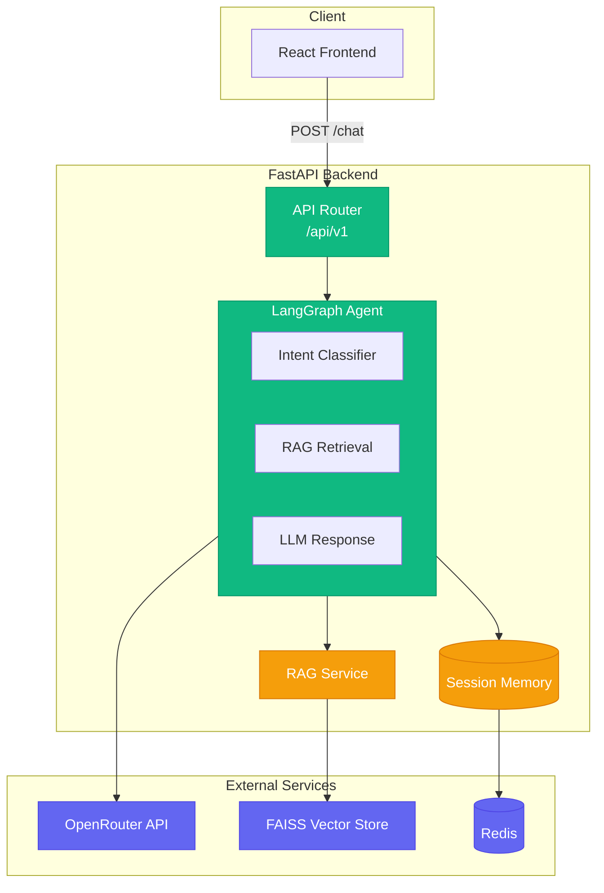
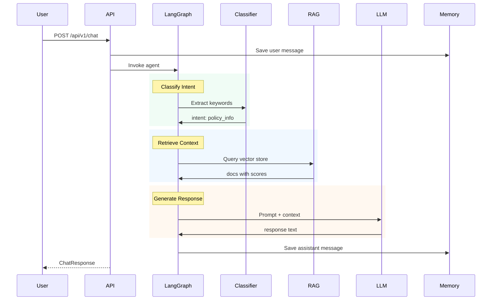

# Life Insurance AI Support Agent

FastAPI-based AI agent system for life insurance customer support with RAG (Retrieval-Augmented Generation).

## Architecture



## Agent Workflow



## Features

- **Intent Classification**: Classifies user intent using LLM
- **RAG**: Retrieves relevant documents from vector store
- **Session Management**: Manages chat history and sessions
- **API**: FastAPI-based API with Swagger documentation
- **Docker**: Dockerized application with Docker Compose

## Quick Start

### Using Docker Compose (Recommended)

1. Copy and configure environment:
```bash
cp .env.docker .env
# Edit .env with your API keys (OpenRouter and LangFuse)
```

2. Start services:
```bash
docker-compose --env-file .env up --build
```

Services:
- Backend: http://localhost:8000
- Frontend: http://localhost:5173
- API Docs: http://localhost:8000/docs

### Local Development

1. Copy environment template:
```bash
cp .env.example .env
# Edit .env with your API keys
```

2. Start backend and frontend:
```bash
# Backend
uv sync
uv run uvicorn main:app --reload

# Frontend (separate terminal)
cd frontend
npm install
npm run dev
```

## Configuration

Create a `.env` file:

```bash
LLM_PROVIDER=openrouter
OPENROUTER_API_KEY=sk-or-v1-********************************
OPENROUTER_MODEL=google/gemini-flash-1.5-8b
VECTORSTORE_PATH=./vectorstore
TOP_K_RETRIEVAL=5
```

## API Endpoints

### Health Check

```bash
GET /api/v1/health
```

### Chat

```bash
POST /api/v1/chat

# Request
{"session_id": "user123", "message": "What is term life insurance?"}

# Response
{"session_id": "user123", "message": "Term life insurance is...", "intent": "policy_info", "sources": [...]}
```

### Session Management

```bash
GET /api/v1/sessions/{session_id}/history
DELETE /api/v1/sessions/{session_id}
```

### Document Ingestion

```bash
POST /api/v1/ingest
{"documents": ["Document text..."]}
```

## Project Structure

```
ray-works/
├── app/
│   ├── api/              # FastAPI endpoints
│   ├── agents/           # LangGraph workflow
│   ├── services/        # RAG, LLM services
│   ├── memory/           # Session management
│   ├── models/          # Pydantic schemas
│   └── core/            # Config, logging
├── frontend/
│   ├── src/components/  # React components
│   ├── context/         # Chat state
│   └── services/        # API layer
├── data/raw_docs/       # Insurance knowledge
├── tests/               # Backend tests
├── Dockerfile           # Backend image
├── docker-compose.yml   # Full stack
└── .env                 # Environment
```

## Testing

```bash
# Backend
pytest

# Frontend
cd frontend && npm test

# Lint
ruff check .
cd frontend && npm run lint
```

## Docker Commands

```bash
docker-compose up -d        # Start services
docker-compose logs -f      # View logs
docker-compose down         # Stop services
```

## Developed By

Mazharul Islam Leon
Github: <https://github.com/mazleon>
<b>
Website: <https://mazleon.com>
