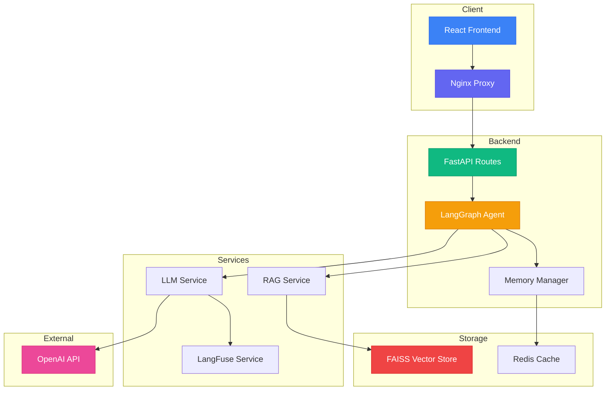
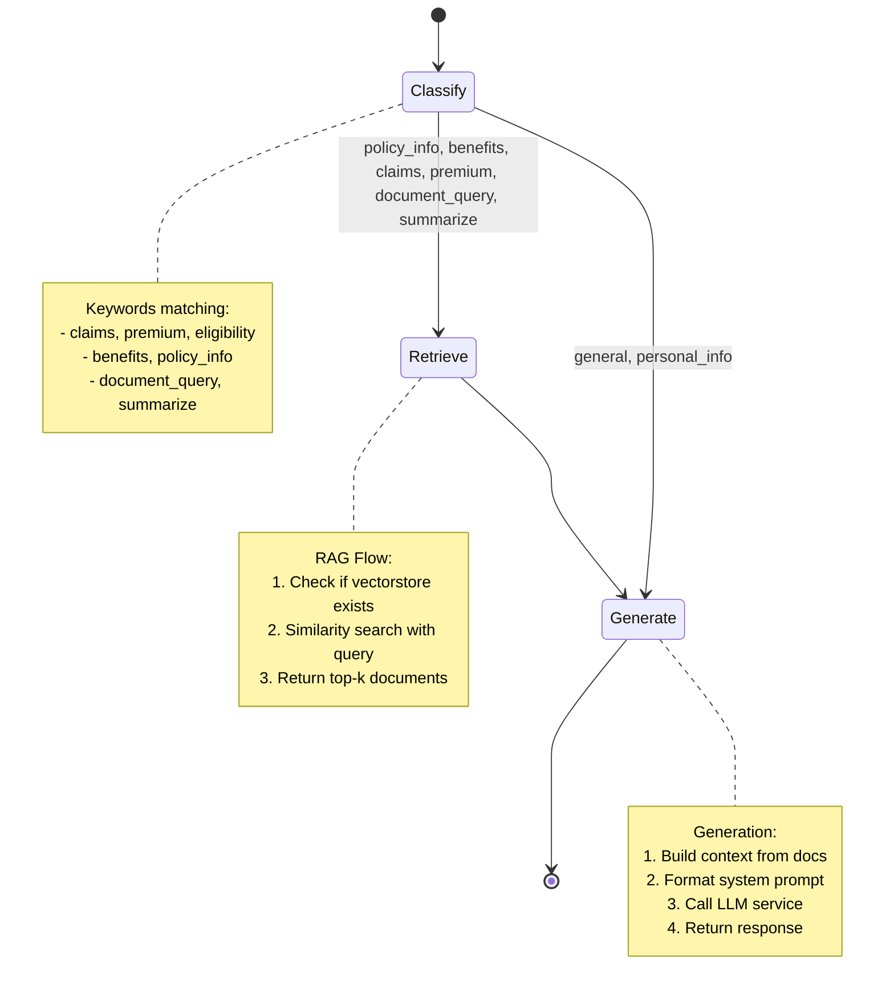
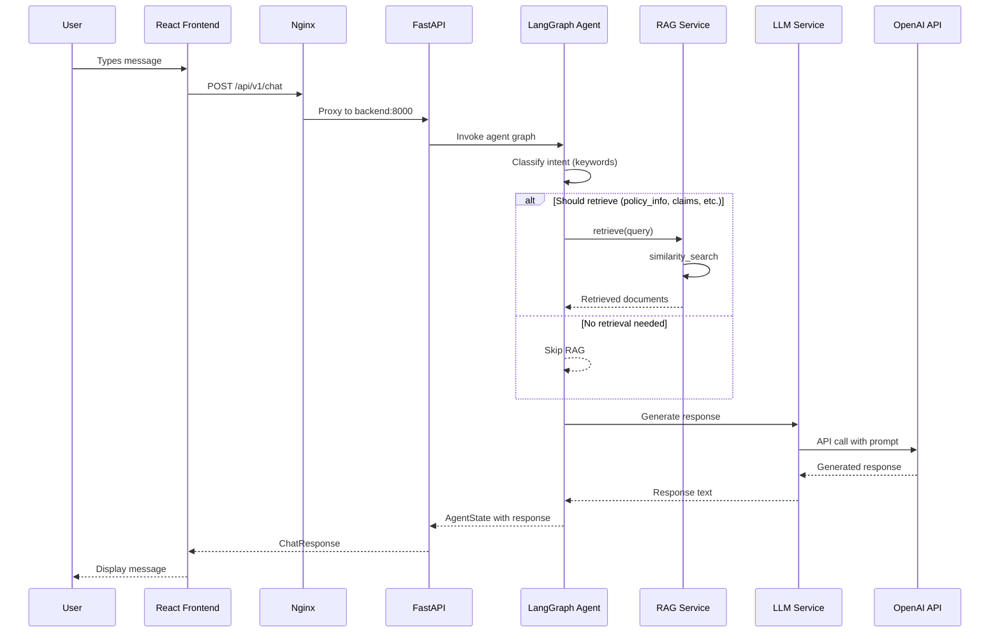
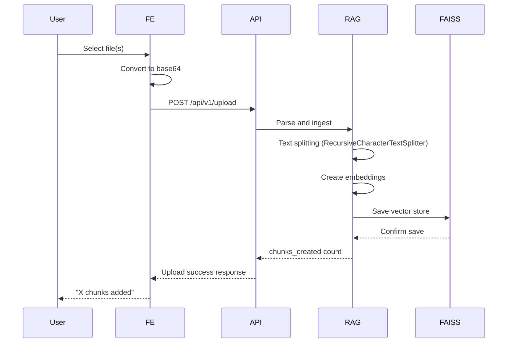

# Life Insurance AI Support Agent - Technical Documentation

## Table of Contents

1. [Overview](#overview)
2. [Architecture](#architecture)
3. [System Components](#system-components)
4. [Data Flow](#data-flow)
5. [API Reference](#api-reference)
6. [Configuration](#configuration)
7. [Deployment](#deployment)
8. [Development Guide](#development-guide)
9. [Troubleshooting](#troubleshooting)

---

## Overview

The Life Insurance AI Support Agent is an intelligent chatbot system designed to assist customers with life insurance inquiries. It combines a React frontend with a FastAPI backend, leveraging Retrieval-Augmented Generation (RAG) and Large Language Models (LLMs) to provide accurate, contextual responses.

### Key Capabilities

- **Intent Classification**: Automatically identifies user intent (claims, premiums, eligibility, etc.)
- **Document Retrieval**: Uses FAISS vector store for semantic search
- **Conversational Memory**: Maintains session history and extracts user information
- **Document Upload**: Supports PDF, DOCX, and TXT file uploads
- **Observability**: LangFuse integration for LLM tracing and monitoring

---

## Architecture

### High-Level Architecture

```
┌─────────────────────────────────────────────────────────────────────────────┐
│                              CLIENT LAYER                                    │
│  ┌─────────────────────────────────────────────────────────────────────────┐  │
│  │                      React Frontend (Port 5173)                        │  │
│  │  ┌──────────┐  ┌──────────┐  ┌──────────┐  ┌────────────────────────┐  │  │
│  │  │ Sidebar  │  │ChatWindow│  │ChatInput │  │    ChatContext (State) │  │  │
│  │  └──────────┘  └──────────┘  └──────────┘  └────────────────────────┘  │  │
│  └─────────────────────────────────────────────────────────────────────────┘  │
└──────────────────────────────────────┬──────────────────────────────────────┘
                                       │
                                       │ HTTP/WebSocket
                                       ▼
┌─────────────────────────────────────────────────────────────────────────────┐
│                            NGINX PROXY (Port 5173)                           │
│  ┌──────────────────────────────────────────────────────────────────────────┐  │
│  │  /api/* → http://backend:8000                                          │  │
│  │  /*    → Static files (React build)                                    │  │
│  └──────────────────────────────────────────────────────────────────────────┘  │
└──────────────────────────────────────┬──────────────────────────────────────┘
                                       │
                                       ▼
┌─────────────────────────────────────────────────────────────────────────────┐
│                            BACKEND LAYER                                    │
│  ┌─────────────────────────────────────────────────────────────────────────┐  │
│  │                      FastAPI Server (Port 8000)                         │  │
│  │                                                                         │  │
│  │  ┌────────────────────────────────────────────────────────────────────┐ │  │
│  │  │                    API Routes (/api/v1)                           │ │  │
│  │  │  ┌──────────┐  ┌──────────┐  ┌──────────┐  ┌──────────────────┐  │ │  │
│  │  │  │  /health  │  │  /chat   │  │  /upload │  │  /sessions/*     │  │ │  │
│  │  │  └──────────┘  └──────────┘  └──────────┘  └──────────────────┘  │ │  │
│  │  └────────────────────────────────────────────────────────────────────┘ │  │
│  │                                    │                                     │  │
│  │  ┌────────────────────────────────▼────────────────────────────────┐  │  │
│  │  │              LangGraph Agent Pipeline                           │  │  │
│  │  │                                                             │  │  │
│  │  │  ┌────────────┐    ┌────────────┐    ┌───────────────────┐  │  │  │
│  │  │  │  Classify  │───▶│  Retrieve  │───▶│      Generate     │  │  │  │
│  │  │  │   Node     │    │    Node    │    │       Node        │  │  │  │
│  │  │  └────────────┘    └────────────┘    └───────────────────┘  │  │  │
│  │  │        │                   │                    │             │  │  │
│  │  │        ▼                   ▼                    ▼             │  │  │
│  │  │  Intent Keywords    RAG Service        LLM Service          │  │  │
│  │  │  + Memory          + FAISS            + OpenAI              │  │  │
│  │  └────────────────────────────────────────────────────────────────┘  │  │
│  └───────────────────────────────────────────────────────────────────────┘  │
└──────────────────────────────────────┬──────────────────────────────────────┘
                                       │
          ┌────────────────────────────┼────────────────────────────┐
          │                            │                            │
          ▼                            ▼                            ▼
┌─────────────────────┐  ┌─────────────────────┐  ┌─────────────────────┐
│   LLM Provider      │  │   Vector Store      │  │   Session Store     │
│   (OpenAI API)     │  │   (FAISS Files)     │  │   (Redis/Local)      │
│                     │  │                     │  │                     │
│  - gpt-4o-mini      │  │  - index.faiss     │  │  - Session History  │
│  - text-embedding   │  │  - index.pkl        │  │  - User Context     │
│    3-small          │  │                     │  │                     │
└─────────────────────┘  └─────────────────────┘  └─────────────────────┘
```

### Component Diagram



---

## System Components

### 1. Frontend (React + TypeScript)

**Location**: `frontend/`

**Tech Stack**:
- React 18 with TypeScript
- Tailwind CSS for styling
- Vite for build tooling
- Zustand/Context for state management

**Components**:
- `ChatWindow`: Main chat interface
- `ChatInput`: Message input with submit
- `MessageBubble`: Individual message display
- `Sidebar`: Session management and document upload

**Key Files**:
```
frontend/src/
├── components/
│   ├── ChatWindow.tsx    # Main chat container
│   ├── ChatInput.tsx     # Message input component
│   ├── MessageBubble.tsx # Message display
│   └── Sidebar.tsx      # Navigation and upload
├── context/
│   └── ChatContext.tsx   # Global state management
├── services/
│   └── api.ts            # API client layer
└── types/
    └── index.ts          # TypeScript definitions
```

### 2. Backend (FastAPI + LangGraph)

**Location**: `app/`

**Tech Stack**:
- FastAPI for REST API
- LangGraph for agent orchestration
- LangChain for LLM integration
- FAISS for vector storage
- Pydantic for data validation

**Agent Pipeline (LangGraph)**:



### 3. RAG Service

**File**: `app/services/rag.py`

**Functionality**:
- Document ingestion and chunking
- Vector store management (FAISS)
- Semantic similarity search
- Context retrieval for LLM

**Key Methods**:
```python
class RAGService:
    def ingest_documents(documents: List[str]) -> int:
        """Ingest documents into vector store"""
        
    async def retrieve(query: str, k: int = 5) -> List[Dict]:
        """Retrieve relevant documents"""
        
    def _load_vectorstore() -> None:
        """Load existing vector store"""
        
    def _save_vectorstore() -> None:
        """Save vector store to disk"""
```

### 4. LLM Service

**File**: `app/services/llm.py`

**Features**:
- OpenAI API integration
- Streaming responses support
- Configurable model parameters

---

## Data Flow

### Chat Request Flow



### Document Upload Flow



---

## API Reference

### Base URL

```
Production: http://localhost:5173/api/v1
Development: http://localhost:8000/api/v1
```

### Endpoints

#### 1. Health Check

```http
GET /api/v1/health
```

**Response**:
```json
{
  "status": "healthy",
  "version": "1.0.0",
  "environment": "development"
}
```

#### 2. Chat

```http
POST /api/v1/chat
```

**Request**:
```json
{
  "session_id": "string (optional)",
  "message": "string (required)"
}
```

**Response**:
```json
{
  "session_id": "uuid-string",
  "message": "Generated response text",
  "intent": "policy_info",
  "sources": ["reference1", "reference2"]
}
```

#### 3. Upload Document

```http
POST /api/v1/upload
```

**Request**:
```json
{
  "filename": "document.pdf",
  "content": "base64_encoded_content",
  "session_id": "string (optional)"
}
```

**Response**:
```json
{
  "status": "success",
  "chunks_created": 5,
  "message": "Successfully processed document.pdf"
}
```

#### 4. Session History

```http
GET /api/v1/sessions/{session_id}/history
DELETE /api/v1/sessions/{session_id}
```

---

## Configuration

### Environment Variables

| Variable | Required | Default | Description |
|----------|----------|---------|-------------|
| `APP_ENV` | No | `development` | Application environment |
| `LLM_PROVIDER` | No | `openai` | LLM provider (openai/openrouter) |
| `OPENAI_API_KEY` | Yes | - | OpenAI API key |
| `OPENAI_MODEL` | No | `gpt-4o-mini` | Model to use |
| `EMBEDDING_MODEL` | No | `text-embedding-3-small` | Embedding model |
| `VECTORSTORE_PATH` | No | `./vectorstore` | FAISS store path |
| `TOP_K_RETRIEVAL` | No | `5` | Documents to retrieve |
| `REDIS_URL` | No | `redis://localhost:6379` | Redis connection |
| `LANGFUSE_ENABLED` | No | `false` | Enable LangFuse |

### Docker Environment Template

See `.env.docker` for complete template.

---

## Deployment

### Docker Compose (Recommended)

```bash
# 1. Copy environment template
cp .env.docker .env

# 2. Edit .env with your API keys
#    - OPENAI_API_KEY from https://platform.openai.com/api-keys

# 3. Start all services
docker-compose up --build

# 4. Access the application
#    - Frontend: http://localhost:5173
#    - Backend API: http://localhost:8000
#    - API Docs: http://localhost:8000/docs
```

### Services

| Service | Port | Description |
|---------|------|-------------|
| frontend | 5173 | React app with Nginx proxy |
| backend | 8000 | FastAPI application |
| redis | 6379 | Session storage (optional) |

### Volume Mounts

```yaml
volumes:
  - ./app:/app/app        # Backend code
  - ./data:/app/data     # Raw documents
  - ./vectorstore:/app/vectorstore  # FAISS index
```

---

## Development Guide

### Local Setup

```bash
# Backend
cp .env.example .env
# Edit .env with API keys
uv sync
uv run uvicorn main:app --reload

# Frontend (separate terminal)
cd frontend
npm install
npm run dev
```

### Running Tests

```bash
# Backend
pytest

# Frontend
cd frontend && npm test

# Lint
ruff check .
```

### Project Structure

```
ray-works/
├── app/
│   ├── api/              # API routes
│   │   ├── routes.py     # Endpoint handlers
│   │   └── router.py     # Route definitions
│   ├── agents/          # LangGraph workflow
│   │   └── graph.py     # Agent pipeline
│   ├── services/        # Business logic
│   │   ├── rag.py       # RAG service
│   │   ├── llm.py       # LLM service
│   │   ├── memory.py    # Session management
│   │   └── langfuse.py   # Observability
│   ├── memory/          # Session storage
│   ├── models/          # Pydantic schemas
│   └── core/            # Configuration
├── frontend/
│   ├── src/
│   │   ├── components/  # React components
│   │   ├── context/    # State management
│   │   ├── services/   # API client
│   │   └── types/      # TypeScript types
│   ├── package.json
│   └── vite.config.ts
├── docs/                 # Documentation
├── docker-compose.yml    # Full-stack config
├── Dockerfile           # Backend image
├── nginx.conf           # Nginx proxy config
└── .env.docker         # Environment template
```

---

## Troubleshooting

### Common Issues

#### 1. "Missing API Key"
- **Cause**: `OPENAI_API_KEY` not set
- **Solution**: Add to `.env` file

#### 2. "RAG Not Working"
- **Cause**: Vector store not loaded
- **Solution**: Upload documents first, then query

#### 3. "Frontend 404 on API calls"
- **Cause**: Nginx proxy misconfiguration
- **Solution**: Verify `nginx.conf` proxy settings

#### 4. "Session not found"
- **Cause**: Redis not accessible
- **Solution**: Check Redis connection or use in-memory fallback

### Logs

```bash
# View all logs
docker-compose logs -f

# View specific service
docker-compose logs -f backend
docker-compose logs -f frontend
```

---

## Appendix

### Intent Classification Keywords

| Intent | Keywords |
|--------|----------|
| `claims` | file claim, claim, process, submit, death benefit |
| `premium` | premium, cost, price, pay, monthly, yearly |
| `eligibility` | eligible, qualify, requirement, age limit |
| `benefits` | benefit, payout, coverage amount |
| `policy_info` | policy, term, coverage, plan, insurance, life insurance |
| `document_query` | my document, my file, uploaded, what does it say |
| `summarize` | summarize, summary, recap, what did we discuss |
| `personal_info` | my name, who am i, remember me |

### Technology Stack

| Layer | Technology |
|-------|------------|
| Frontend | React, TypeScript, Tailwind CSS, Vite |
| Backend | FastAPI, Python 3.10+, LangGraph, LangChain |
| LLM | OpenAI (GPT-4o-mini), Embeddings (text-embedding-3-small) |
| Vector Store | FAISS |
| Session Store | Redis (optional), In-memory fallback |
| Observability | LangFuse |
| Deployment | Docker, Docker Compose, Nginx |

---

*Document Version: 1.0.0*  
*Last Updated: April 2026*
